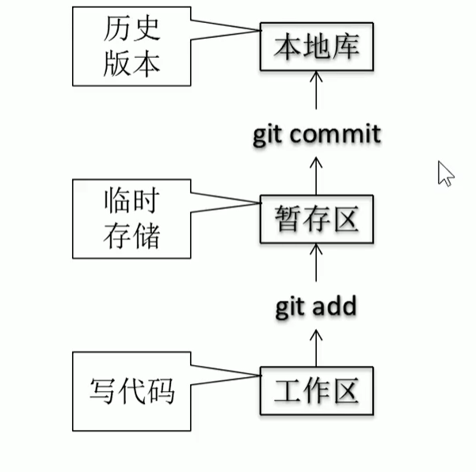

# 一、Github
## 1. 版本控制
### 1.1 版本控制工具应该具备的功能
    1. 协同修改
       * 多人并行不悖的修改服务器端的同一个文件
    2. 数据备份
       * 不仅保存目录和文件的当前状态，还能保存每一个提交过的历史状态
    3. 版本管理
       * 保存每一个版本的文件信息时做到不保存重复数据，来节约存储空间，提高效率。
       * SVN采用增量式管理方式
       * Git采用文件系统快照方式
    4. 权限控制
       * 对团队中参与开发的人员进行权限控制
       * 对团队外开发者贡献的代码进行审核--Git独有
    5. 历史记录
       * 查看修改人、修改时间、修改内容日志信息
    6. 分支管理
       * 允许开发团队在工作过程中多条生产线同时推进任务。
### 1.2 版本控制简介
    1. 版本控制 
       * 工程设计领域中使用版本控制管理工程蓝图的设计过程。在IT开发过程中也可以使用版本控制思想管理代码的版本迭代。
    2. 版本控制工具
       思想：版本控制
       实现：版本控制工具
```     
    集中式版本控制工具：CVS、SVN、VSS......
        优点: 
            代码存放在单一的服务器上 便于项目的管理
        缺点: 
            服务器宕机: 员工写的代码得不到保障
            服务器炸了: 整个项目的历史记录都会丢失
```
```
    分布式版本控制工具：Git、Mercurial、Bazaar、Darcs......
        优点:
            完全的分布式
        缺点:    
            学习起来比SVN陡峭
```
## 2. Git简介
### Git历史
   
   https://git-scm.com/
### Git的优势
* 大部分操作在本地完成，不需要联网
* 完整性保证
* 尽可能添加数据而不是删除或修改数据
* 分支操作非常快捷流畅
* 与Linux命令全面兼容
### Git结构

### Git和代码托管中心
代码托管中心的任务：维护远程库
局域网环境下
1. GitLab服务器

外网环境下：
1. GitHub
2. 码云
## 3. Git命令行操作
### 本地库操作
1. 本地库初始化
    命令：git init  
    注意：git目录中存放的是本地库相关的子目录和文件，不要删除，也不要胡乱修改。
2. 设置签名
    形式：用户名 邮箱地址  
    作用：区分不同开发人员的身份  
    辨析：这里设置的签名和登录远程库(代码托管中心)的账号、密码没有任何关系。  
    命令
      1. 项目级别/仓库级别：仅在当前本地库范围内有效  
        git config user.name ***  
        git config user.email***  
        信息保存位置：./.git/config文件
      2. 系统用户级别：登录当前操作系统的用户范围  
        git config --global user.name ***  
        git config --global user.email ***  
        信息保存位置：~/.gitconfig文件
      3. 级别优先级  
         就近原则：项目级别优先于系统用户级别，二者都有时采用项目级别的签名;  
         如果只有系统用户级别的签名，就以系统用户级别的签名为准;  
         二者都没有不允许
3. 基本操作
   git status 查看工作区、缓存区状态
   git add 将工作区的“新建/修改”添加到暂存区
   hhggg
### 远程库操作
## 4. Git图形化界面操作
## 5. Gitlab服务器环境搭建
